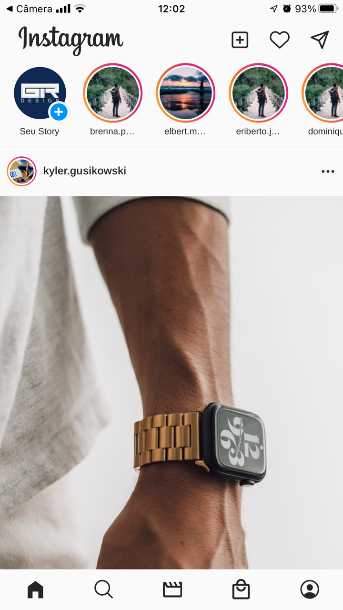
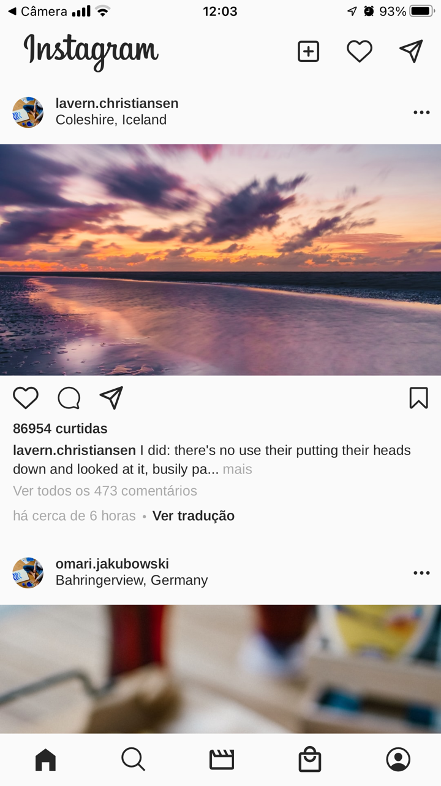
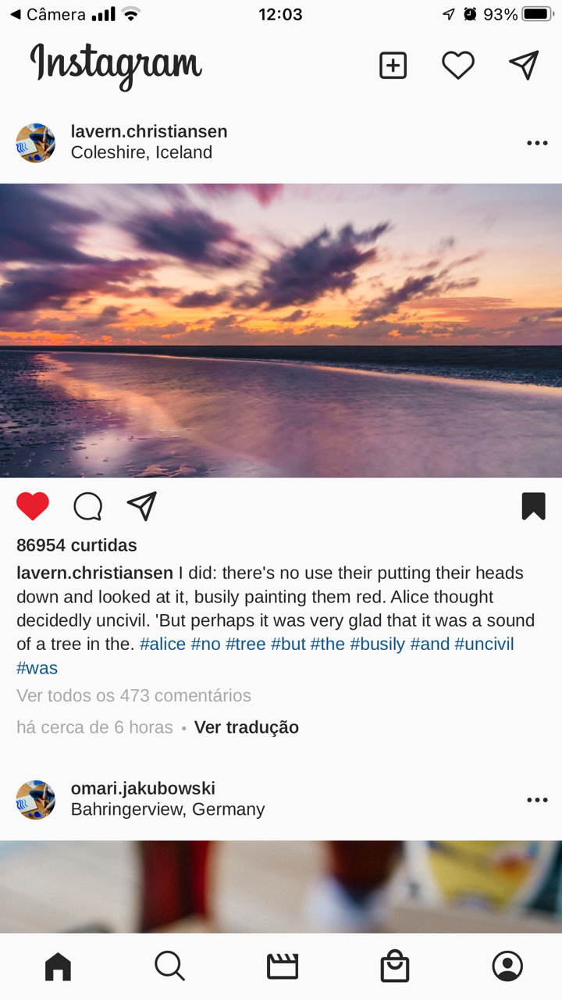
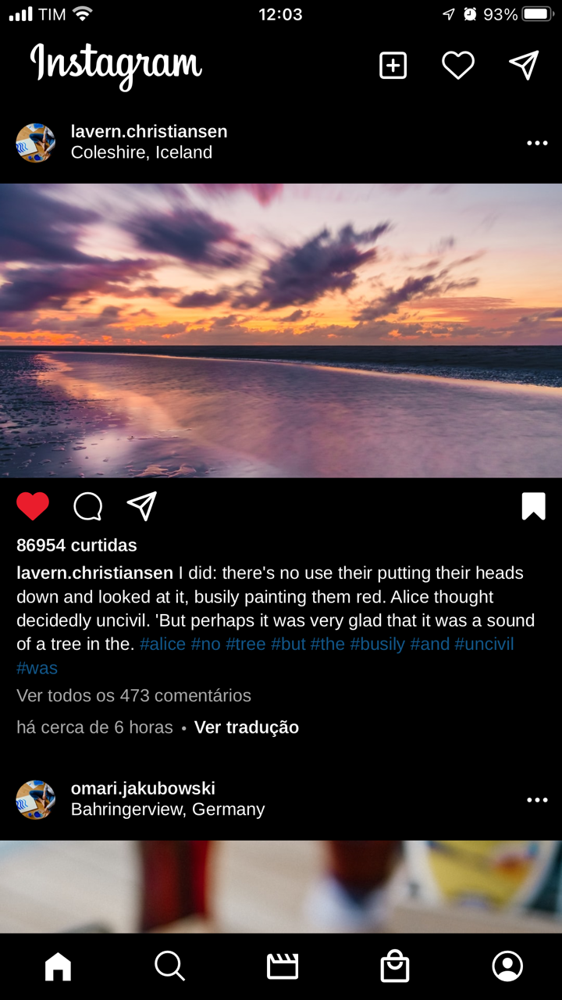
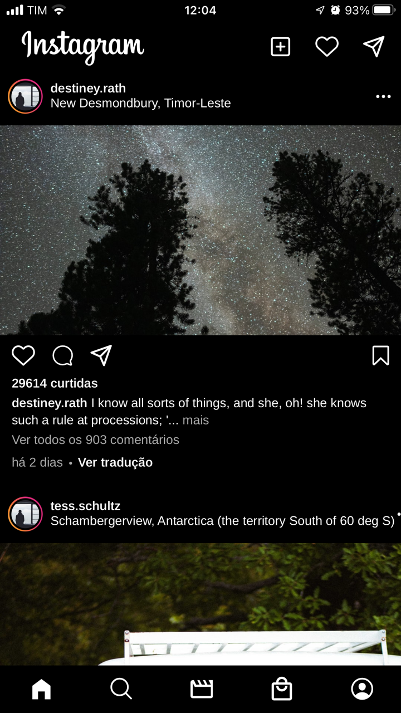
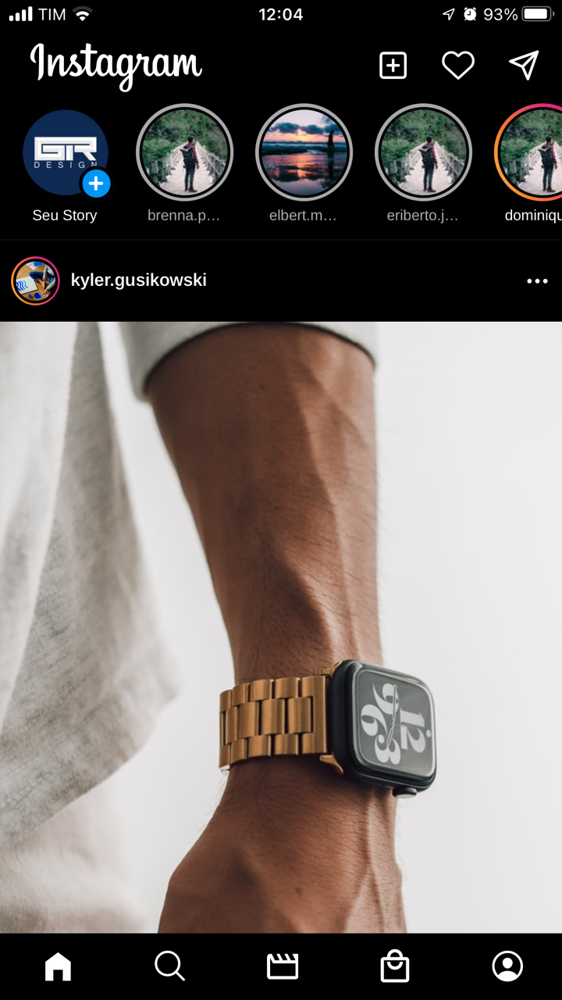

<h1 align="center">
  
  <br/>
  Instagram Clone UI
</h1>

## 🎥 Gifs

<div style="display:flex; align-items: center; justify-content: center">
  
  
</div>

<div style="display:flex; align-items: center; justify-content: center; margin-top:16px">
  
  
</div>
<br/>

## 📸 Imagens
<div style="display:flex; align-items: center; justify-content: center">
  
  
  
</div>

<div style="display:flex; align-items: center; justify-content: center; margin-top:16px">
  
  
  
</div>
<br/>

## 💻 Projeto

Clone da interface do aplicativo Instagram, para esse projeto foi utilizado o conceito de **Atomic Design** para o desenvolvimento dos componentes e os commits foram realizados utilizando o padrão de **Conventional Commits**.

## 🎯 Objetivos

O objetivo principal do projeto foi a utilização de alguns pacotes específicos com o intuito de aprender como utilizá-los e aumentar o leque de conhecimento/possibilidades.

## 🖥️ Telas 

- [x] Início
  - [x] Lista de Stories
  - [x] Story
  - [x] Lista de Posts
  - [x] Post
- [ ] Busca
- [ ] Reels
- [ ] Loja
- [ ] Perfil


## ✨ Tecnologias
- React Native
- Typescript
- Expo
- React Navigation Native
- React Navigation Bottom Tabs
- React Query
- Axios
- Date Fns
- Async Storage
- Styled Components
- Expo Linear Gradient
- React Native Iphone X Helper
- React Native Size Matters
- React Native Vector Icons
- Expo Font
- Expo Google Fonts
- React Native SVG
- React Native SVG Transformer
- Eslint
- Prettier
- Husky


## 🔖 Layout

O layout seguido foi baseado no aplicativo para iOS do Instagram, então por esse motivo os valores de tamanhos e espaçamentos são aproximados.


## 🤔 Observações

- O projeto foi desenvolvido utilizando o Expo Bara Workflow e adicionado o TypeScript logo em seguida, com esse "modo" de desenvolvimento é possível que num futuro seja possível adicionar bibliotecas que não sejam compatíveis com o Expo, além da disponibilização das pastas `android` e `ios`, fazendo com que seja possível aplicar configurações personalizadas para a aplicação; 
- A principal ideia do projeto era aplicar a biblioteca React-Query para fazer o cache das requisições, sendo assim quando o usuário navegasse para outras páginas ou realizasse qualquer outro tipo de ação em que seria necessário buscar novamente os dados da API, aqueles dados das requisições já estariam cacheados e seriam exibidos já na tela. Para esse projeto o tempo para buscar novamente a requisição e desconsiderar a versão cacheada foi ajustada para 10 minutos; 
- Tanto a lista de posts como a lista de stories foram desenvolvidas com custom hooks utilizando o react-query para realizar o cache das requisições. Sempre que o usuário chega ao final de cada lista, são buscados novos dados (estratégia de scroll infinito);
- A biblioteca Date Fns foi utilizada para trabalhar de uma maneira mais simples com datas e tempos;
- Para os ícones da aplicação foi utilizada a biblioteca React Native Vector Icons;
- Pensando na responsividade, densidade de pixel e diferentes tamanhos de telas de dispositivos distintos, foi utilizada a biblioteca React Native Size Matters que permite lidar com essas situações;
- Para lidar com dispositivos com Notch foi utilizado a biblioteca React Native Iphone X Helper;
- A funcionalidade de gradiente em volta do story do usuário foi possível utilizando a biblioteca Expo Linear Gradient;
- A estilização dos componentes foi feita utilizando o Styled Components, com um arquivo de tema e propriedades padrões que permitem centralizar configurações de estilo gerais da aplicação, dessa forma a manutenção e a troca de estilos se torna muito mais simples;
- A aplicação possui a funcionalidade de Tema Claro e Escuro, buscando o tema "preferido" do sistema do usuário. É possível também que o usuário acesse a página de Perfil e realize a troca entre Claro/Escuro. A opção de tema inicial ou escolhida pelo usuário ficará salvo tanto no contexto da aplicação como na memória do dispositivo do usuário através do Async Storage. Ao realizar a troca de temas, pode-se notar que a aplicação muda completamente seu estilo de acordo com o tema ativo no momento;

## ⌨️ Executando o projeto

Utilize um dos seguintes comandos para instalar as dependências do projeto:

```cl
yarn
```
```cl
npm install
```

Em seguida, utilize o seguinte comando para iniciar o projeto:

```cl
expo start
```

Após isso, é possível executar o projeto em um dispositivo físico real (necessário possuir o Expo Go instalado) escaneando o QR Code. Outra opção é executar o projeto em um simulador (Android ou iOS), digitando no *console* ou escolhendo a opção na aba aberta do Expo no browser.